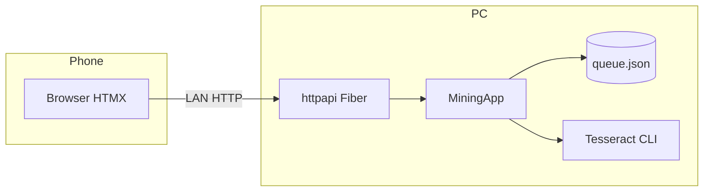
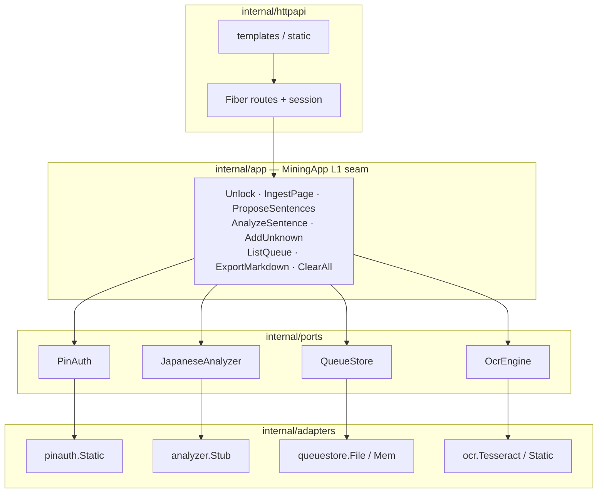
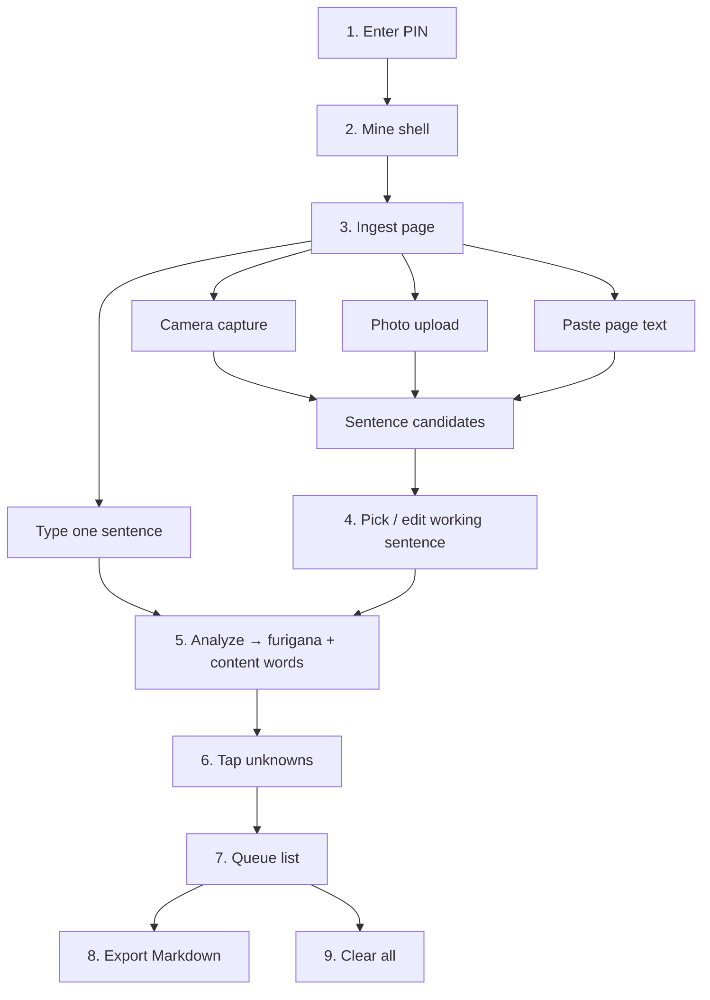
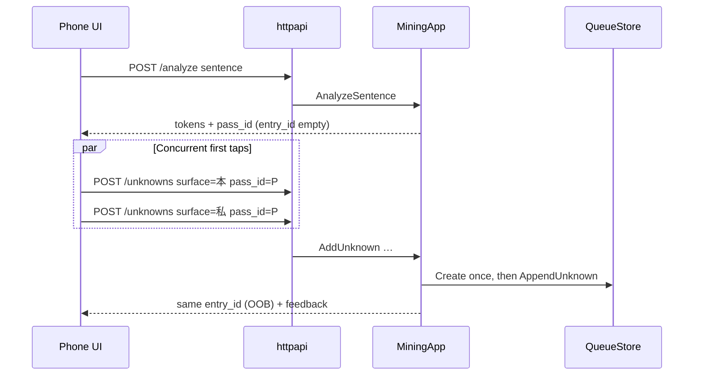
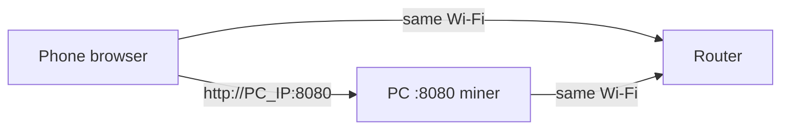

# miner

Local home-server app for mining Japanese novel vocabulary from a phone browser on your LAN.  
Unlock with a shared PIN → capture or paste a page → analyze → mark unknowns → export Markdown.  
No Anki, no cloud OCR, no translation API — everything stays on your PC.

Product plans: [`.scratch/novel-miner/`](.scratch/novel-miner/spec.md) · Domain vocabulary: [`CONTEXT.md`](CONTEXT.md)  
License: [MIT](LICENSE)

---

## Table of contents

1. [What it is](#what-it-is)
2. [Architecture at a glance](#architecture-at-a-glance)
3. [Learner flow](#learner-flow)
4. [Pass protocol (why one tap doesn’t make two cards)](#pass-protocol-why-one-tap-doesnt-make-two-cards)
5. [Repository layout](#repository-layout)
6. [HTTP routes](#http-routes)
7. [Quick start (PC)](#quick-start-pc)
8. [Stepped setup](#stepped-setup)
9. [Phone on LAN (step-by-step)](#phone-on-lan-step-by-step)
10. [Configuration](#configuration)
11. [OCR (Tesseract)](#ocr-tesseract)
12. [Daily use walkthrough](#daily-use-walkthrough)
13. [Testing](#testing)
14. [Tickets](#tickets)
15. [Feature notes](#feature-notes)

---

## What it is

| | |
|--|--|
| **Runs on** | Your home PC (single Go process) |
| **Used from** | Phone browser on the **same Wi‑Fi** (or localhost on the PC) |
| **Auth** | One shared PIN (session cookie; re-PIN after process restart) |
| **Durable data** | Queue file only (`MINER_DATA_DIR/queue.json`) |
| **Ephemeral** | Session, analyze `pass_id` map, OCR image bytes |



---

## Architecture at a glance

Product rules live in **MiningApp**. Fiber handlers only map HTTP ↔ facade. Ports keep adapters swappable.



| Layer | Package | Responsibility |
|-------|---------|----------------|
| Process | `cmd/miner` | Env, data dir, wire adapters, listen, LAN URL hints |
| HTTP adapter | `internal/httpapi` | Cookies, multipart, HTMX partials, status ↔ product errors |
| Facade | `internal/app` | All product rules (C1: new use-cases land here first) |
| Ports | `internal/ports` | Small interfaces only |
| Adapters | `internal/adapters/*` | PIN, analyzer stub, file/mem queue, Tesseract / Static OCR |
| Web | `web/` | Embedded templates + HTMX + camera JS |

**Architectural rule (C1):** if a rule can be unit-tested without HTTP, it belongs on **MiningApp**, not in a handler body.

### Data that survives restart

| Data | Survives restart? | Where |
|------|-------------------|--------|
| Queue entries + unknowns | Yes | `MINER_DATA_DIR/queue.json` (owner-only `0o600`) |
| Session “unlocked” | No | In-memory Fiber session store |
| `pass_id` → entry bind | No | In-memory on MiningApp |
| Uploaded / camera images | Never written | Held in request memory, discarded |

---

## Learner flow



1. **PIN** unlock → mining shell  
2. **Ingest** a page — camera, upload (≤10 MiB), multi-sentence paste, or single sentence  
3. **Pick** a candidate (or edit) → **Analyze** → HTML ruby + content-word list  
4. **Tap** content words → save unknowns (save / duplicate feedback)  
5. **Queue** → list entries → **Export Markdown** (queue unchanged) or **Clear all**  

No per-unknown remove in v1. Photos discarded after OCR. Primary material = novel prose; non-novel is best-effort.

---

## Pass protocol (why one tap doesn’t make two cards)

Each **Analyze** returns an ephemeral **`pass_id`**. First successful mark with that pass creates one durable queue entry; later marks (or concurrent multi-taps) with the same pass append to the **same** entry. Re-analyze → new pass → **new** entry even if the sentence text is identical (no merge-by-text).



| Field | Durable? | Role |
|-------|----------|------|
| `pass_id` | No | Binds taps from one analyze result to one entry |
| `entry_id` | Yes (in queue) | Set after first save; further appends use it |
| `sentence` + `surface` | In queue after save | Working sentence + tapped surface form |

Clear all wipes the queue **and** pass bindings (coordinated so concurrent mark+clear cannot orphan binds).

---

## Repository layout

```
cmd/miner/                    # process entry, LAN hints, resolveWebFS
internal/app/                 # MiningApp facade (primary test seam)
internal/ports/               # PinAuth, JapaneseAnalyzer, QueueStore, OcrEngine
internal/adapters/pinauth/    # static shared PIN
internal/adapters/analyzer/   # Stub JapaneseAnalyzer (fixtures + fallback)
internal/adapters/ocr/        # Tesseract (prod) + Static (tests)
internal/adapters/queuestore/ # file + mem QueueStore
internal/httpapi/             # Fiber + session + handlers
internal/ocrtest/             # OCR fixture loader (tests)
web/templates/                # pin, shell, queue, partials
web/static/                   # htmx.min.js, camera.js
e2e/                          # headless UI journeys (rod)
testdata/ocr/                 # synthetic page fixtures
.scratch/novel-miner/         # product plans / tickets
data/                         # runtime queue (created on run; gitignored)
```

| Path | When you change… |
|------|------------------|
| `internal/app` | Product rules, errors, pass/ingest behavior |
| `internal/httpapi` | Routes, cookies, HTML status mapping |
| `web/templates` | Phone UI chrome and partials |
| `internal/adapters/*` | How PIN / OCR / queue / analyzer are implemented |
| `e2e/` | Full click paths (PIN → export → clear) |

---

## HTTP routes

All mining routes require session except `/` and `POST /unlock`.

| Method | Path | Purpose |
|--------|------|---------|
| `GET` | `/` | PIN page or shell if already unlocked |
| `POST` | `/unlock` | Verify PIN → session cookie (rate-limited per IP) |
| `GET` | `/home` | Mining shell |
| `POST` | `/page-text` | Paste → sentence candidates (HTMX) |
| `POST` | `/ingest` | Multipart `image` → OCR → candidates (HTMX) |
| `POST` | `/analyze` | Sentence → furigana + content words + `pass_id` |
| `POST` | `/unknowns` | Mark unknown (`sentence`, `surface`, `entry_id?`, `pass_id?`) |
| `GET` | `/queue` | Queue HTML + export / clear controls |
| `GET` | `/export` | UTF-8 Markdown download (does **not** clear queue) |
| `POST` | `/queue/clear` | Wipe queue (UI confirms when N≥1) |
| `GET` | `/static/*` | HTMX, camera.js, assets |

---

## Quick start (PC)

**Prerequisites:** Go 1.22+ (see `go.mod`), and for photo OCR: Tesseract + Japanese data (see [OCR](#ocr-tesseract)).

```bash
git clone <repo-url> && cd miner
export MINER_PIN='choose-a-shared-pin'
make run
# open http://127.0.0.1:8080
```

---

## Stepped setup

### 1. Install Go

```bash
go version   # need a recent Go that matches go.mod
```

### 2. Clone and enter the repo

```bash
git clone <repo-url>
cd miner
```

### 3. (Recommended) Install Tesseract for photo / camera mining

Without Tesseract the server **will not start** (production requires a real OCR engine).

```bash
# Debian / Ubuntu
sudo apt install tesseract-ocr tesseract-ocr-jpn tesseract-ocr-jpn-vert

# Verify
tesseract --list-langs | grep jpn
```

macOS (Homebrew) example:

```bash
brew install tesseract tesseract-lang
```

### 4. Choose a PIN (required)

```bash
export MINER_PIN='your-shared-pin'   # not committed; known to household only
```

### 5. Build and run

```bash
make run
# equivalent:
# make build && ./bin/miner
# go run ./cmd/miner
```

On success you should see logs like:

```text
Dev: http://127.0.0.1:8080
LAN: open http://<this-pc-ip>:8080 from your phone on the same Wi‑Fi
  try http://192.168.x.x:8080
miner listening on :8080 (queue=data/queue.json)
```

### 6. Open on the PC first

1. Browser → [http://127.0.0.1:8080](http://127.0.0.1:8080)  
2. Enter `MINER_PIN` → you should see the **Mine** shell  
3. Paste `私は本を読む。` → Analyze → confirm furigana + content words  

### 7. Optional: live template edit

```bash
export MINER_WEB_ROOT=/absolute/path/to/miner/web
make run
```

Uses on-disk `templates/` + `static/` instead of the embedded FS.

### 8. Stop

`Ctrl+C` in the terminal. Queue file under `data/` (or `MINER_DATA_DIR`) remains; session is gone → re-PIN next start.

---

## Phone on LAN (step-by-step)

Goal: phone browser talks to the PC process over Wi‑Fi.



### Step 1 — Same network

- Phone and PC on the **same Wi‑Fi** (not guest isolation if your router isolates clients).  
- Prefer 2.4/5 GHz home LAN; avoid phone cellular data.

### Step 2 — Bind all interfaces (default)

Default `MINER_ADDR=:8080` listens on **all** interfaces (phone-reachable).

**Wrong for phone** (loopback only):

```bash
export MINER_ADDR=127.0.0.1:8080   # phone cannot connect
```

**Right for phone:**

```bash
export MINER_ADDR=:8080            # default; all interfaces
# or explicit LAN IP:
export MINER_ADDR=192.168.1.10:8080
```

### Step 3 — Start miner and read LAN hints

```bash
export MINER_PIN='your-shared-pin'
make run
```

Copy a line like `try http://192.168.1.42:8080` from the log.

If no IPv4 listed:

```bash
# Linux example
ip -4 addr show
# or
hostname -I
```

Use a non-loopback address (not `127.0.0.1`).

### Step 4 — Firewall (if phone cannot connect)

Allow inbound TCP **8080** on the PC.

```bash
# Ubuntu ufw example
sudo ufw allow 8080/tcp
sudo ufw status
```

Windows: allow Go / `miner` through Windows Defender Firewall for private networks.  
macOS: System Settings → Network → Firewall → allow incoming for the binary if prompted.

### Step 5 — Open on the phone

1. Phone browser (Safari / Chrome).  
2. Address bar: `http://192.168.x.x:8080` (your PC IP from step 3).  
3. **http** not https (local LAN; cookie is `HttpOnly` + `SameSite=Lax`, not Secure).  
4. Enter the same `MINER_PIN` as the PC.  
5. You should see **Mine** / **Queue** nav.

### Step 6 — Camera permission (optional)

1. On Mine → **Open camera**.  
2. Allow camera for the site when prompted.  
3. **Capture page** → same OCR path as file upload.  
4. If denied / no camera → use **Page photo** upload or paste text.

HTTPS is not required for many phones on LAN, but some browsers are stricter about camera on plain HTTP; if camera fails, upload or paste still work.

### Step 7 — Smoke the full path on phone

1. Upload or capture a clear novel page (or paste text).  
2. Pick a sentence → Analyze → tap 1–2 content words.  
3. Open **Queue** → confirm entries.  
4. **Export Markdown** → file downloads.  
5. **Clear all** → confirm dialog when N≥1.

### Troubleshooting phone access

| Symptom | Check |
|---------|--------|
| Connection refused / timeout | PC running? Same Wi‑Fi? Firewall? Correct IP? |
| Opens then “Session required” | Cookie blocked? Retry unlock; avoid private-mode quirks |
| PIN always wrong | Same `MINER_PIN` as process env; rate limit after many fails (wait ~1 min) |
| No LAN IP in logs | PC offline / only loopback; connect Wi‑Fi or set `MINER_ADDR` |
| Camera blocked | Use upload; or try another browser; check site permissions |
| OCR empty / garbage | Better photo, fill frame, less tilt; edit sentence; paste text fallback |

---

## Configuration

| Env | Required | Default | Meaning |
|-----|----------|---------|---------|
| `MINER_PIN` | **yes** | — | Shared unlock PIN (never commit) |
| `MINER_ADDR` | no | `:8080` | Listen address (`:8080` = all interfaces) |
| `MINER_WEB_ROOT` | no | *(embedded)* | Disk override of `templates/` + `static/` |
| `MINER_DATA_DIR` | no | `data` | Durable queue directory (`queue.json`) |
| `MINER_TESSERACT` | no | `tesseract` on `PATH` | Tesseract binary |
| `MINER_TESSDATA_PREFIX` | no | (engine default) | Tessdata dir (`jpn` / `jpn_vert`) |
| `MINER_OCR_LANG` | no | `jpn+jpn_vert` | Tesseract `-l` string |

Example full launch:

```bash
export MINER_PIN='household-pin'
export MINER_ADDR=:8080
export MINER_DATA_DIR="$HOME/.local/share/miner"
export MINER_TESSERACT=/usr/bin/tesseract
make run
```

---

## OCR (Tesseract)

Production wires `internal/adapters/ocr.Tesseract` (CLI, no CGO).

```bash
# Debian/Ubuntu
sudo apt install tesseract-ocr tesseract-ocr-jpn tesseract-ocr-jpn-vert

# Custom install
export MINER_TESSERACT=/path/to/tesseract
export MINER_TESSDATA_PREFIX=/path/to/tessdata   # contains jpn.traineddata
```

| Rule | Behavior |
|------|----------|
| Max image size | 10 MiB (`app.MaxUploadBytes`) |
| Single-flight | One ingest at a time (`409` if busy) |
| Queue on OCR fail | Untouched |
| Image persistence | Never written under data dir |
| Product normalize | `NormalizePageText` in MiningApp (not in Tesseract) |

**Tests:** default harnesses use `ocr.Static` (no host tesseract). Real CLI tests call `ocr.MustEngine` and **skip** if missing.

```bash
export MINER_OCR_CONTRACT=1
go test ./internal/adapters/ocr/ -count=1 -run Contract -timeout 5m
```

Fixtures: `testdata/ocr/` (55 cases). Tags include **happy**, **vertical**, **blur**, **brightness**, **font**, etc.

---

## Daily use walkthrough

| Goal | What to do |
|------|------------|
| Mine from photo | Mine → camera or **Page photo** → pick sentence → Analyze → tap words |
| Mine from paste | **Page text** → Propose → pick → Analyze → tap |
| One sentence only | Working sentence box → Analyze → tap |
| Review queue | **Queue** nav |
| Backup unknowns | **Export Markdown** (queue stays) |
| Wipe session work | **Clear all** (confirm) |
| After PC reboot | Start `make run` again → re-enter PIN → queue file still there |

Export shape (nested list, order by first-unknown-at):

```markdown
- 病院に行った。
  - 病院
  - 行った
- 私は本を読む。
  - 本
```

---

## Testing

```bash
make test          # L1 + L2 + L3
make test-unit     # internal packages only
make test-e2e      # headless browser only
make lint          # vet + staticcheck + ineffassign + deadcode
```

| Layer | Where | What |
|-------|--------|------|
| **L1** | `internal/app` | Product rules via MiningApp (fakes + mem/file store + `ocr.Static`) |
| **L2** | `internal/httpapi` | Fiber `app.Test`: session, HTMX, multipart, pass transport |
| **L3** | `e2e` | rod + Chromium: PIN → ingest paths → mark → export → clear |
| **OCR-real** | selected | `MustEngine`; skips without tesseract |

L3 downloads Chromium once into `~/.cache/rod`.  
HTMX is **vendored** at `web/static/htmx.min.js` (no CDN) so UI tests do not hang offline.

---

## Tickets

| # | Theme | Status |
|---|--------|--------|
| 01 | LAN shell + PIN gate | done |
| 02 | Sentence analyze (paste): furigana + content words | done |
| 03 | Mark unknowns → durable queue | done |
| 04 | Export Markdown (+ Clear all) | done |
| 05 | Full-page text → pick sentence | done |
| 06 | Photo ingest + local OCR | done |
| 07 | Phone camera capture UX | done |
| 08 | Novel UX hardening | done (manual phone novel E2E still recommended) |

---

## Feature notes

### Analyze

- `POST /analyze` requires session.  
- Force-error hook for demos/tests: paste `__analyze_error__`.  
- Production analyzer is still **`analyzer.Stub`** (fixture sentences + whole-text fallback) until a real local morphological engine is chosen.  
- Known fixtures: `私は本を読む。`, `病院に行った。`.

### Camera (ticket 07)

- Client script: `web/static/camera.js` → same `POST /ingest` as upload.  
- No new routes or MiningApp rules.  
- Permission denied / no camera → in-page message; upload remains.

### Unknowns + queue

- Analyze alone does **not** write the queue.  
- Atomic `QueueStore.AppendUnknown`; concurrent same-`pass_id` → one entry.  
- Queue persists across restart; `pass_id` map does not.

### Export + Clear all

- Export does **not** clear.  
- Clear is the only full wipe; UI confirm when N≥1; disabled when empty.  
- Newlines in sentence/surface flattened so Markdown list structure stays intact.

---

## Make targets

| Target | Action |
|--------|--------|
| `make run` | Build + run (needs `MINER_PIN`) |
| `make build` | `bin/miner` |
| `make test` | Full suite (120s timeout) |
| `make test-unit` | `./internal/...` |
| `make test-e2e` | `./e2e/...` |
| `make lint` | static analysis helpers |

---

## License

[MIT](LICENSE) — Copyright (c) 2026 Riki
