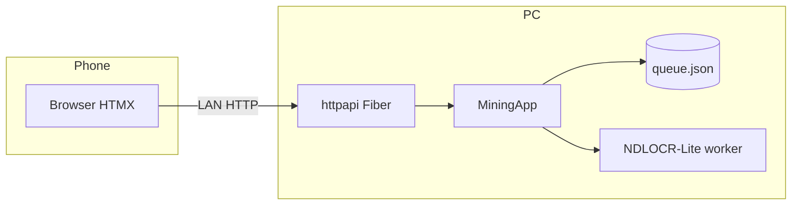
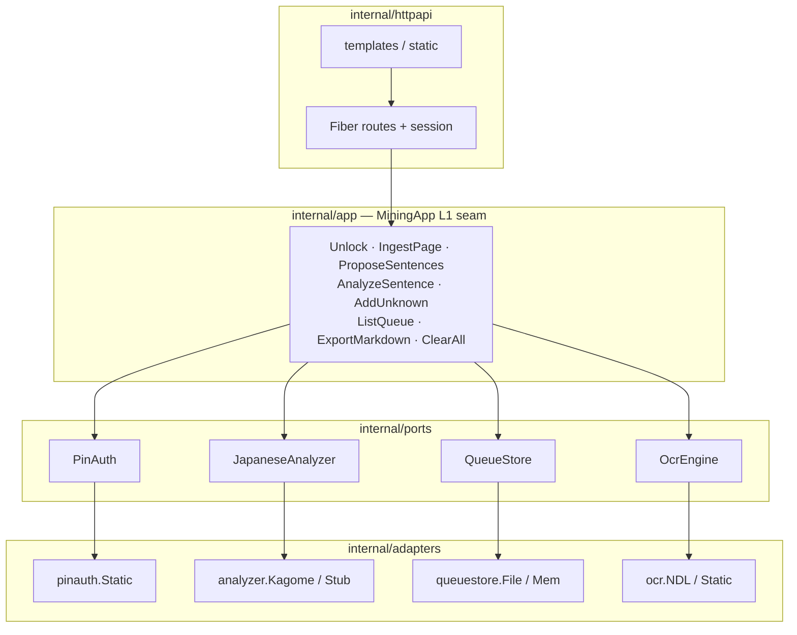
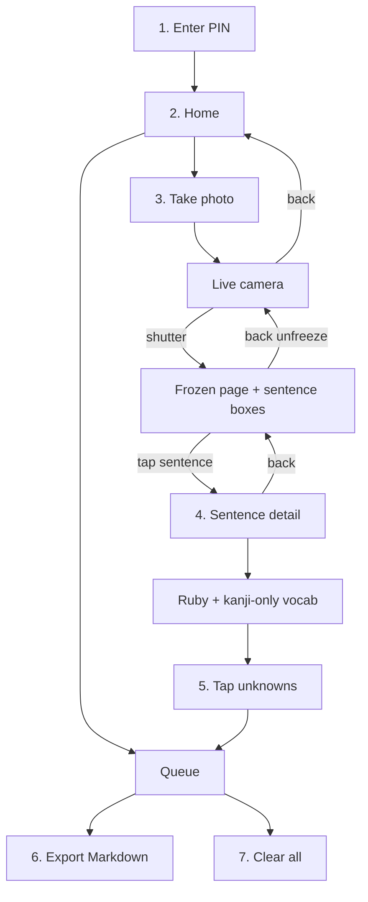
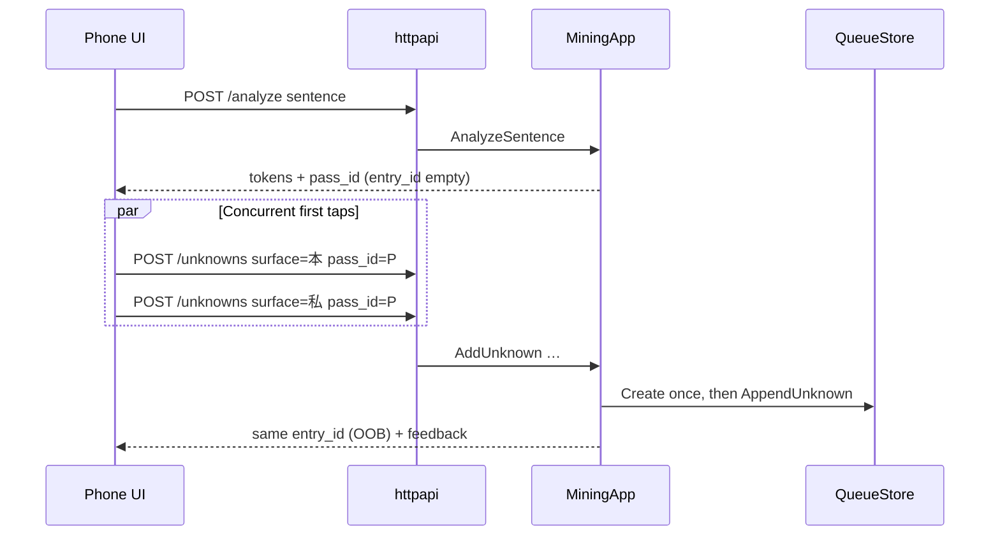
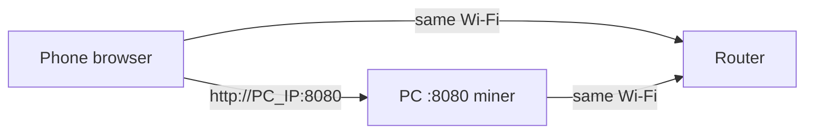
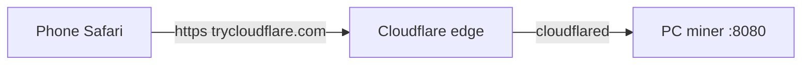

# miner

Local home-server app for mining Japanese novel vocabulary from a phone browser on your LAN.  
Unlock with a shared PIN → take a page photo → tap a sentence → mark kanji unknowns → export Markdown.  
No Anki, no cloud OCR, no translation API — everything stays on your PC.

Product plans: [`.scratch/novel-miner/`](.scratch/novel-miner/spec.md) · Domain vocabulary: [`CONTEXT.md`](CONTEXT.md)  
License: [MIT](LICENSE)

---

## Table of contents

1. [What it is](#what-it-is)
2. [Architecture at a glance](#architecture-at-a-glance)
3. [Learner flow](#learner-flow)
4. [Pass protocol (why one tap doesn’t make two cards)](#pass-protocol-why-one-tap-doesnt-make-two-cards)
5. [Repository layout](#repository-layout)
6. [HTTP routes](#http-routes)
7. [Quick start (PC)](#quick-start-pc)
8. [Stepped setup](#stepped-setup)
9. [Phone on LAN (step-by-step)](#phone-on-lan-step-by-step)
10. [Phone via Cloudflare Tunnel (HTTPS / camera)](#phone-via-cloudflare-tunnel-https--camera)
11. [Configuration](#configuration)
12. [OCR (NDLOCR-Lite)](#ocr-ndlocr-lite)
13. [Daily use walkthrough](#daily-use-walkthrough)
14. [Testing](#testing)
15. [Tickets](#tickets)
16. [Feature notes](#feature-notes)

---

## What it is

| | |
|--|--|
| **Runs on** | Your home PC (single Go process) |
| **Used from** | Phone browser on the **same Wi‑Fi**, or via **HTTPS tunnel** (`make run-tunnel`) for in-page camera; also localhost on the PC |
| **Auth** | One shared PIN from **`.env`** (or env); session cookie; re-PIN after process restart |
| **Durable data** | Queue file only (`MINER_DATA_DIR/queue.json`) |
| **Ephemeral** | Session, analyze `pass_id` map, OCR image bytes |



---

## Architecture at a glance

Product rules live in **MiningApp**. Fiber handlers only map HTTP ↔ facade. Ports keep adapters swappable.



| Layer | Package | Responsibility |
|-------|---------|----------------|
| Process | `cmd/miner` | Env, data dir, wire adapters, listen, LAN URL hints |
| HTTP adapter | `internal/httpapi` | Cookies, multipart JSON ingest, HTMX analyze/unknowns, status ↔ product errors |
| Facade | `internal/app` | All product rules (C1: new use-cases land here first) |
| Ports | `internal/ports` | Small interfaces only |
| Adapters | `internal/adapters/*` | PIN, Kagome / Stub analyzer, file/mem queue, NDLOCR-Lite / Static OCR |
| Web | `web/` | Embedded templates + HTMX + camera JS |

**Architectural rule (C1):** if a rule can be unit-tested without HTTP, it belongs on **MiningApp**, not in a handler body.

### Data that survives restart

| Data | Survives restart? | Where |
|------|-------------------|--------|
| Queue entries + unknowns | Yes | `MINER_DATA_DIR/queue.json` (owner-only `0o600`) |
| Session “unlocked” | No | In-memory Fiber session store |
| `pass_id` → entry bind | No | In-memory on MiningApp |
| Camera capture bytes | Never written | Held in request memory, discarded after OCR |

---

## Learner flow

Stepped phone UI (main / capture not scrollable; sentence detail + queue scroll).



1. **PIN** unlock → **Home** (Take photo · Queue)  
2. **Take photo** → full-bleed camera → shutter → OCR freezes the shot  
3. **Tap a sentence** on the photo (boxes when OCR geometry exists; chips fallback otherwise)  
4. **Sentence detail** (already analyzed) → furigana + **kanji-only** content words  
5. **Tap** words → save unknowns (save / duplicate feedback); **Back** returns to the frozen photo  
6. **Queue** → list → **Export Markdown** (queue unchanged) or **Clear all**  

No file upload, no paste-page, no type-one-sentence in the product UI. No per-unknown remove in v1. Photos discarded after OCR. Primary material = novel prose; non-novel is best-effort.

---

## Pass protocol (why one tap doesn’t make two cards)

Each **Analyze** returns an ephemeral **`pass_id`**. First successful mark with that pass creates one durable queue entry; later marks (or concurrent multi-taps) with the same pass append to the **same** entry. Re-analyze → new pass → **new** entry even if the sentence text is identical (no merge-by-text).



| Field | Durable? | Role |
|-------|----------|------|
| `pass_id` | No | Binds taps from one analyze result to one entry |
| `entry_id` | Yes (in queue) | Set after first save; further appends use it |
| `sentence` + `surface` | In queue after save | Sentence text at first save + tapped surface form |

Clear all wipes the queue **and** pass bindings (coordinated so concurrent mark+clear cannot orphan binds).

---

## Repository layout

```
cmd/miner/                    # process entry, .env load, LAN hints, resolveWebFS
internal/app/                 # MiningApp facade (primary test seam)
internal/ports/               # PinAuth, JapaneseAnalyzer, QueueStore, OcrEngine
internal/adapters/pinauth/    # static shared PIN
internal/adapters/analyzer/   # Kagome (prod) + Stub (tests) JapaneseAnalyzer
internal/adapters/ocr/        # NDL / NDLOCR-Lite (prod) + Static (tests)
scripts/ndl_ocr_worker.py     # long-lived Python worker for NDLOCR-Lite
scripts/install_ndlocr.sh     # make ocr-install (clone + venv + deps; Python 3.10–3.12)
scripts/run_tunnel.sh         # make run-tunnel (miner + free Cloudflare quick tunnel)
requirements-ocr.txt          # Python deps for the OCR worker venv
.env.example                  # template for gitignored .env (MINER_PIN, optional keys)
.deps/                        # local NDLOCR-Lite install (gitignored; make ocr-install)
internal/adapters/queuestore/ # file + mem QueueStore
internal/httpapi/             # Fiber + session + handlers
internal/ocrtest/             # OCR fixture loader (tests)
web/templates/                # pin, home, capture, queue, analyze/unknown partials
web/static/                   # htmx.min.js, camera.js (capture modes)
e2e/                          # headless UI journeys (rod)
testdata/ocr/                 # synthetic page fixtures
.scratch/novel-miner/         # product plans / tickets
data/                         # runtime queue (created on run; gitignored)
```

| Path | When you change… |
|------|------------------|
| `internal/app` | Product rules, errors, pass/ingest behavior |
| `internal/httpapi` | Routes, cookies, HTML status mapping |
| `web/templates` | Phone UI chrome and partials |
| `internal/adapters/*` | How PIN / OCR / queue / analyzer are implemented |
| `cmd/miner/envfile.go` | `.env` loading rules |
| `scripts/run_tunnel.sh` | Cloudflare quick-tunnel launcher |
| `e2e/` | Full click paths (PIN → export → clear) |

---

## HTTP routes

All mining routes require session except `/` and `POST /unlock`.

| Method | Path | Purpose |
|--------|------|---------|
| `GET` | `/` | PIN page, or **home** if already unlocked |
| `POST` | `/unlock` | Verify PIN → session cookie (rate-limited per IP) → home |
| `GET` | `/home` | Home hub: **Take photo** · **Queue** |
| `GET` | `/capture` | Full-page camera / freeze / in-page sentence detail |
| `POST` | `/ingest` | Multipart `image` → OCR → **JSON** `{candidates, regions, img_w, img_h}` (or `{error}`) |
| `POST` | `/analyze` | Sentence → furigana + kanji content words + `pass_id` (HTML partial) |
| `POST` | `/unknowns` | Mark unknown (`sentence`, `surface`, `entry_id?`, `pass_id?`) |
| `GET` | `/queue` | Queue HTML + export / clear controls |
| `GET` | `/export` | UTF-8 Markdown download (does **not** clear queue) |
| `POST` | `/queue/clear` | Wipe queue (UI confirms when N≥1) |
| `GET` | `/static/*` | HTMX, camera.js, assets |
| `POST` | `/page-text` | Legacy paste → HTML candidates (not linked in UI; tests/dev) |

---

## Quick start (PC)

**Prerequisites:** Go 1.22+ (see `go.mod`), and for photo OCR: NDLOCR-Lite + Python 3.12/3.11 (see [OCR](#ocr-ndlocr-lite)). Works on **Linux and macOS** (Intel + Apple Silicon).

```bash
git clone <repo-url> && cd miner
make ocr-install                 # NDLOCR-Lite → .deps/ (once; Linux or macOS)
cp .env.example .env             # gitignored
# edit .env → set MINER_PIN=your-shared-pin
make run                         # loads .env; picks up .deps OCR automatically
# open http://127.0.0.1:8080
```

---

## Stepped setup

### 1. Install Go

```bash
go version   # need a recent Go that matches go.mod
```

### 2. Clone and enter the repo

```bash
git clone <repo-url>
cd miner
```

### 3. Install NDLOCR-Lite for photo / camera mining

Without NDLOCR-Lite the server **will not start** (production requires a real local OCR engine).

**Preferred (one command):**

```bash
make ocr-install
# → clones into .deps/ndlocr-lite, creates Python 3.12 (or 3.11/3.10) venv, installs requirements-ocr.txt
# re-run anytime; skips work if already healthy (OCR_UPDATE=1 to force refresh)
# refuses / recreates venvs on unsupported Python (3.13+ lack matching OCR wheels)
```

Needs: `git`, and either [uv](https://github.com/astral-sh/uv) (recommended) or **Python 3.12 / 3.11 / 3.10** only.

| OS | Notes |
|----|--------|
| **Linux** | Default path; `MINER_NDL_DEVICE=cpu` (or `cuda` if onnxruntime-gpu + CUDA) |
| **macOS** | Intel + Apple Silicon; always **CPU** (`MINER_NDL_DEVICE=cpu`). Prefer `brew install python@3.12` or uv. System Python **3.13/3.14** is rejected (no matching onnxruntime wheels). |

`make run` then uses `.deps` automatically when `MINER_NDL_*` are unset. Print exports with `make ocr-env`.

**macOS example:**

```bash
# optional helpers
brew install go git
curl -LsSf https://astral.sh/uv/install.sh | sh   # or: brew install uv
# brew install python@3.12   # if not using uv to fetch Python

make ocr-install
cp .env.example .env   # set MINER_PIN inside
make run
```

**Manual install** (custom path):

```bash
git clone https://github.com/ndl-lab/ndlocr-lite ~/src/ndlocr-lite
uv venv ~/src/ndlocr-lite/.venv --python 3.12
uv pip install --python ~/src/ndlocr-lite/.venv/bin/python -r requirements-ocr.txt
export MINER_NDL_ROOT=~/src/ndlocr-lite
export MINER_NDL_PYTHON=~/src/ndlocr-lite/.venv/bin/python
export MINER_NDL_WORKER=$PWD/scripts/ndl_ocr_worker.py
```

**Credit:** OCR uses [NDLOCR-Lite](https://github.com/ndl-lab/ndlocr-lite) by 国立国会図書館 NDL Lab (CC BY 4.0).

### 4. Choose a PIN (required)

Preferred: put the shared PIN in a gitignored `.env` (shell `export` still works and overrides `.env`):

```bash
cp .env.example .env
# edit .env:
#   MINER_PIN=your-shared-pin
```

Or for a one-off shell session:

```bash
export MINER_PIN='your-shared-pin'
```

Never commit `.env` (already in `.gitignore`).

### 5. Build and run

```bash
make run
# equivalent:
# make build && ./bin/miner   # loads .env from cwd
# go run ./cmd/miner
```

On success you should see logs like (first boot waits while the OCR worker loads models):

```text
Dev: http://127.0.0.1:8080
LAN: open http://<this-pc-ip>:8080 from your phone on the same Wi‑Fi
  try http://192.168.x.x:8080
miner listening on :8080 (queue=data/queue.json)
```

If startup fails with `OCR engine: …`, fix `MINER_NDL_ROOT` / `MINER_NDL_PYTHON` / `MINER_NDL_WORKER` (see [OCR](#ocr-ndlocr-lite)).

### 6. Open on the PC first

1. Browser → [http://127.0.0.1:8080](http://127.0.0.1:8080)  
2. Enter `MINER_PIN` → **Home** with **Take photo** and **Queue**  
3. **Take photo** → allow camera (localhost is a secure context) → capture a page or use a phone via tunnel for real novel shots  
4. Tap a sentence → confirm furigana + kanji-only content words  

### 7. Optional: live template edit

```bash
export MINER_WEB_ROOT=/absolute/path/to/miner/web
make run
```

Uses on-disk `templates/` + `static/` instead of the embedded FS.

### 8. Stop

`Ctrl+C` in the terminal. Queue file under `data/` (or `MINER_DATA_DIR`) remains; session is gone → re-PIN next start.

---

## Phone on LAN (step-by-step)

Goal: phone browser talks to the PC process over Wi‑Fi.



### Step 1 — Same network

- Phone and PC on the **same Wi‑Fi** (not guest isolation if your router isolates clients).  
- Prefer 2.4/5 GHz home LAN; avoid phone cellular data.

### Step 2 — Bind all interfaces (default)

Default `MINER_ADDR=:8080` listens on **all** interfaces (phone-reachable).

**Wrong for phone** (loopback only):

```bash
export MINER_ADDR=127.0.0.1:8080   # phone cannot connect
```

**Right for phone:**

```bash
export MINER_ADDR=:8080            # default; all interfaces
# or explicit LAN IP:
export MINER_ADDR=192.168.1.10:8080
```

### Step 3 — Start miner and read LAN hints

```bash
# MINER_PIN from .env (or export MINER_PIN=...)
make run
```

Copy a line like `try http://192.168.1.42:8080` from the log.

If no IPv4 listed:

```bash
# Linux example
ip -4 addr show
# or
hostname -I
```

Use a non-loopback address (not `127.0.0.1`).

### Step 4 — Firewall (if phone cannot connect)

Allow inbound TCP **8080** on the PC.

```bash
# Ubuntu ufw example
sudo ufw allow 8080/tcp
sudo ufw status
```

Windows: allow Go / `miner` through Windows Defender Firewall for private networks.  
macOS: System Settings → Network → Firewall → allow incoming for the binary if prompted.

### Step 5 — Open on the phone

1. Phone browser (Safari / Chrome).  
2. Address bar: `http://192.168.x.x:8080` (your PC IP from step 3).  
3. **http** not https (local LAN; cookie is `HttpOnly` + `SameSite=Lax`, not Secure).  
4. Enter the same `MINER_PIN` as the PC.  
5. You should see **Home**: **Take photo** · **Queue**.

### Step 6 — Camera permission (required for mining)

1. Home → **Take photo**.  
2. Allow camera when prompted.  
3. Shutter → page freezes → tap a boxed sentence (or chip if geometry missing).  
4. On sentence detail, tap kanji content words → **Queue**.

HTTPS is not required for many phones on LAN, but **iOS Safari does not expose `getUserMedia` on plain `http://LAN-IP`**. If the camera does not open, use [Cloudflare Tunnel](#phone-via-cloudflare-tunnel-https--camera) so Safari sees HTTPS.

### Step 7 — Smoke the full path on phone

1. Capture a clear novel page (fill the frame, reduce tilt).  
2. Tap a sentence → tap 1–2 kanji content words.  
3. Open **Queue** → confirm entries.  
4. **Export Markdown** → file downloads.  
5. **Clear all** → confirm dialog when N≥1.

### Troubleshooting phone access

| Symptom | Check |
|---------|--------|
| Connection refused / timeout | PC running? Same Wi‑Fi? Firewall? Correct IP? |
| Opens then “Session required” | Cookie blocked? Retry unlock; avoid private-mode quirks |
| PIN always wrong | Same `MINER_PIN` as in `.env` / process env; rate limit after many fails (wait ~1 min) |
| No LAN IP in logs | PC offline / only loopback; connect Wi‑Fi or set `MINER_ADDR` |
| Camera blocked | Plain HTTP is not a secure context on iPhone Safari — use `make run-tunnel` |
| `make run` says MINER_PIN required | `cp .env.example .env` and set `MINER_PIN=…`, or `export MINER_PIN=…` |
| Tunnel URL won’t open camera | Confirm you opened the **https://\*.trycloudflare.com** URL (not LAN `http://`) |
| OCR empty / garbage | Better photo, fill frame, less tilt; retake; no boxes → chips list still tappable |
| Server dies at start with “OCR engine” | `MINER_NDL_ROOT` / python / worker wrong — see [OCR](#ocr-ndlocr-lite) |
| First photo very slow | Normal: models warm on process start; later pages should be faster |

---

## Phone via Cloudflare Tunnel (HTTPS / camera)

Goal: give the phone a **real HTTPS origin** so Safari allows the in-page camera, without installing local TLS certs.

Uses [Cloudflare quick tunnels](https://developers.cloudflare.com/cloudflare-one/connections/connect-networks/do-more-with-tunnels/trycloudflare/) (`*.trycloudflare.com`) — **free, no Cloudflare account**. URL is temporary and changes each run.



### Prerequisites

1. Same as `make run`: `MINER_PIN` in `.env` (or env), OCR install (`make ocr-install`).
2. [cloudflared](https://developers.cloudflare.com/cloudflare-one/connections/connect-networks/downloads/) on PATH:

```bash
# macOS
brew install cloudflared
```

### Start

```bash
# ensure .env has MINER_PIN=… (or export MINER_PIN=...)
make run-tunnel
```

Implementation: `make run-tunnel` → `scripts/run_tunnel.sh` starts miner, waits until HTTP is ready, then runs `cloudflared tunnel --url http://127.0.0.1:<port>`.

1. Wait for cloudflared to print a box with `https://….trycloudflare.com`.  
2. Open that URL on the phone (any network — not limited to home Wi‑Fi).  
3. Enter PIN → **Take photo** → allow camera when Safari prompts.  
4. `Ctrl+C` stops miner and the tunnel.

Default bind is `127.0.0.1:8080` (loopback only; tunnel is the phone path). To also keep LAN HTTP while tunneling, set in `.env` or the shell:

```bash
# .env: MINER_ADDR=:8080
# or:
export MINER_ADDR=:8080
make run-tunnel
```

### Security notes

| | |
|--|--|
| **Public URL** | Anyone who has the trycloudflare link can hit the PIN page until you stop |
| **Auth** | Same shared PIN + unlock rate limit as LAN mode |
| **When done** | Stop the process; do not leave a quick tunnel running unattended |
| **OCR data** | Still processed only on your PC; Cloudflare only proxies HTTPS |

Named / zero-trust tunnels (account + fixed hostname) are out of scope here; this target is the zero-config free path for camera.

---

## Configuration

### `.env` file (preferred for PIN)

On startup, `cmd/miner` loads **`.env` from the process working directory** (usually the repo root when you `make run`).

| Rule | Behavior |
|------|----------|
| Missing `.env` | OK — use real environment only |
| Key already set in the shell | **Shell wins** (`.env` does not override) |
| Template | Copy [`.env.example`](.env.example) → `.env` (gitignored) |
| Never commit | `.env` is in `.gitignore`; only `.env.example` is tracked |

```bash
cp .env.example .env
# edit MINER_PIN=… (and any optional keys)
make run
# or HTTPS for phone camera:
make run-tunnel
```

### Environment variables

| Env | Required | Default | Meaning |
|-----|----------|---------|---------|
| `MINER_PIN` | **yes** | — | Shared unlock PIN (set in `.env` or environment; never commit) |
| `MINER_ADDR` | no | `:8080` | Listen address (`:8080` = all interfaces). `make run-tunnel` defaults to `127.0.0.1:8080` unless set |
| `MINER_WEB_ROOT` | no | *(embedded)* | Disk override of `templates/` + `static/` |
| `MINER_DATA_DIR` | no | `data` | Durable queue directory (`queue.json`) |
| `MINER_NDL_ROOT` | for OCR | `.deps/ndlocr-lite` via `make` | Absolute path to [ndlocr-lite](https://github.com/ndl-lab/ndlocr-lite) clone |
| `MINER_NDL_PYTHON` | for OCR | `.deps/.../.venv/bin/python` via `make` | Venv interpreter with `requirements-ocr.txt` deps |
| `MINER_NDL_WORKER` | for OCR | `scripts/ndl_ocr_worker.py` via `make` | Path to miner’s worker script |
| `MINER_NDL_DEVICE` | no | `cpu` | `cpu` or `cuda` (Linux GPU only; **macOS must use `cpu`**) |
| `MINER_NDL_ENABLE_TCY` | no | off | `1` / `true` enables 縦中横 helper in the worker |

Example full launch:

```bash
make ocr-install   # once
cp .env.example .env
# edit .env:
#   MINER_PIN=household-pin
#   MINER_ADDR=:8080
#   MINER_DATA_DIR=/home/you/.local/share/miner
make run           # loads .env; MINER_NDL_* default to .deps/
```

---

## OCR (NDLOCR-Lite)

Production photo / camera ingest uses **[NDLOCR-Lite](https://github.com/ndl-lab/ndlocr-lite)** (国立国会図書館 NDL Lab) — a CPU-friendly Japanese book/magazine OCR stack with layout detection, character recognition, and **reading-order** (縦書き columns right→left). **No Tesseract. No cloud OCR.**

### How miner wires it

```text
Phone camera capture
  → POST /ingest (httpapi, Accept: application/json)
  → MiningApp.IngestPage
  → ports.OcrEngine.Recognize(ctx, image bytes) → OcrResult
  → adapters/ocr.NDL  (Go)
       writes temp image
       JSON line → scripts/ndl_ocr_worker.py (long-lived Python)
       ← text + line boxes + image size
  → NormalizePageText → SplitSentences → MapLinesToSentenceRegions
  → JSON { candidates, regions, img_w, img_h }
```

| Piece | Role |
|-------|------|
| `internal/ports.OcrEngine` | Seam: `Recognize(ctx, image) → OcrResult{Text, Lines, Width, Height}` |
| `internal/adapters/ocr.NDL` | Prod adapter: starts/owns worker, honors cancel/deadline |
| `internal/adapters/ocr.Static` | Test double (default L1/L2/L3 — no Python needed) |
| `scripts/ndl_ocr_worker.py` | Loads ONNX models **once**, then answers JSON requests |
| `requirements-ocr.txt` | Python pins for the worker venv (install into NDL’s venv) |

Worker protocol (one JSON object per line):

```json
{"id":"1","image_path":"/tmp/miner-ocr-xxx.png"}
{"id":"1","ok":true,"text":"病院に行った。\n私は本を読む。",
 "img_width":1920,"img_height":1080,
 "lines":[{"text":"病院に行った。","x":10,"y":20,"w":100,"h":40}]}
```

On startup the worker emits `{"ready":true}` after models load; miner waits (default up to 120s) before accepting traffic that needs OCR.

**Product hygiene stays in MiningApp:** `NormalizePageText`, `SplitSentences`, and sentence-region mapping. The adapter returns engine text + optional geometry only.

### Install (home PC, CPU) — Linux & macOS

**Preferred:**

```bash
make ocr-install          # → .deps/ndlocr-lite + venv + deps (idempotent)
cp .env.example .env      # set MINER_PIN (once)
make run                  # loads .env; uses .deps when MINER_NDL_* unset
```

Needs **git** and either [uv](https://github.com/astral-sh/uv) (recommended) or Python **3.12 / 3.11 / 3.10**. System Python 3.14 often lacks `onnxruntime` wheels.

| Helper | Action |
|--------|--------|
| `make ocr-install` | Clone + venv + `requirements-ocr.txt` into `.deps/` (gitignored) |
| `make ocr-env` | Print `export MINER_NDL_*=…` for the default/current paths |
| `OCR_UPDATE=1 make ocr-install` | `git pull` + reinstall deps |

| Platform | Runtime | Notes |
|----------|---------|--------|
| Linux x86_64 / arm64 | CPU or optional CUDA | `MINER_NDL_DEVICE=cpu` (default) or `cuda` |
| macOS Intel | CPU | `onnxruntime==1.23.2` pin; no CUDA |
| macOS Apple Silicon | CPU | same; first model load a few seconds |

**Manual** (custom location): set `MINER_NDL_ROOT` / `MINER_NDL_PYTHON` / `MINER_NDL_WORKER` yourself; see stepped setup.

**Verify worker alone** (optional, after install):

```bash
make ocr-env   # copy exports, or rely on .deps defaults
.deps/ndlocr-lite/.venv/bin/python scripts/ndl_ocr_worker.py
# expect one line: {"ready": true}
# then type (example): {"id":"1","image_path":"testdata/ocr/images/01_single_sentence.png"}
# Ctrl+D to exit
```

### Product rules (ingest)

| Rule | Behavior |
|------|----------|
| Max image size | 10 MiB (`app.MaxUploadBytes`) |
| Timeout | `MaxIngestDuration` (60s) on parent context |
| Single-flight | One ingest at a time (`409` if busy) |
| Queue on OCR fail | Untouched |
| Image persistence | Never written under data dir (temp file only, deleted after OCR) |
| Response | JSON candidates + normalized sentence regions (empty regions → UI chips) |
| Empty OCR text | `ErrEmptyPage` after normalize |
| Cancel mid-OCR | `ErrIngestCanceled` |

### Performance notes

| Phase | What to expect |
|-------|----------------|
| Process start | Worker loads ONNX models (~several seconds on CPU) |
| Warm page | Often ~1–few seconds for a simple novel crop |
| Cold first request | If worker not pre-started, first recognize pays model load |

Miner starts the worker in `NewNDLFromEnv()` at boot so the first phone shot is usually warm.

### Attribution & license

OCR models and code: **[NDLOCR-Lite](https://github.com/ndl-lab/ndlocr-lite)** by [NDL Lab](https://lab.ndl.go.jp/) / 国立国会図書館, licensed **CC BY 4.0**.  
Miner (this repo) remains **MIT**; keep NDL credit when you redistribute the OCR stack.

### OCR tests

| Kind | When | How |
|------|------|-----|
| Default suite | Always | `ocr.Static` — `make test` needs **no** Python/models |
| Fake worker | Always | Go unit tests drive a stub Python script (protocol only) |
| Real smoke | Host with `MINER_NDL_*` | `go test ./internal/adapters/ocr/ -run Smoke` |
| Contract | Optional | `make ocr-contract` or `MINER_OCR_CONTRACT=1` |

```bash
make ocr-install   # if not already installed

# smoke (skips if engine missing)
go test ./internal/adapters/ocr/ -count=1 -run 'Smoke' -timeout 3m -v

# full fixture contract (happy / vertical / blur / brightness / font / …)
make ocr-contract
```

Fixtures: `testdata/ocr/` (55 cases). Tags: **happy**, **vertical**, **novel**, **blur**, **brightness**, **font**, **thickness**, **colour**, **tilt**, etc. Soft (log-only) IDs for known-hard phone stress live in `internal/adapters/ocr/ndl_test.go`.

---

## Daily use walkthrough

| Goal | What to do |
|------|------------|
| Mine from photo | Home → **Take photo** → shutter → tap sentence → tap kanji words |
| Review queue | Home → **Queue** |
| Backup unknowns | **Export Markdown** (queue stays) |
| Wipe session work | **Clear all** (confirm) |
| After PC reboot | Start `make run` again → re-enter PIN → queue file still there |
| iPhone camera | Prefer `make run-tunnel` (HTTPS); plain LAN HTTP often blocks camera |

Export shape (nested list, order by first-unknown-at):

```markdown
- 病院に行った。
  - 病院
  - 行った
- 私は本を読む。
  - 本
```

---

## Testing

```bash
make test          # L1 + L2 + L3 + cmd/miner (no NDLOCR-Lite required)
make test-unit     # internal packages only
make test-e2e      # headless browser only
make ocr-contract  # real NDLOCR-Lite fixtures (needs MINER_NDL_*)
make lint          # vet + staticcheck + ineffassign + deadcode
```

| Layer | Where | What |
|-------|--------|------|
| **L1** | `internal/app` | Product rules via MiningApp (fakes + mem/file store + `ocr.Static`) |
| **L2** | `internal/httpapi` | Fiber `app.Test`: session, HTMX, multipart, pass transport |
| **L3** | `e2e` | rod + Chromium: PIN → home → capture freeze → pick → mark → export → clear |
| **Process** | `cmd/miner` | `.env` loader, LAN hints, `.env.example` / Makefile / tunnel script contracts |
| **OCR-real** | selected | `MustEngine` / smoke + contract; skips without NDLOCR-Lite env |

L3 downloads Chromium once into `~/.cache/rod`.  
HTMX is **vendored** at `web/static/htmx.min.js` (no CDN) so UI tests do not hang offline.

Process/contract tests cover: `loadDotEnv` (no override of existing env), parse of `.env.example`, `make run-tunnel` wiring, `bash -n` on `scripts/run_tunnel.sh` and `install_ndlocr.sh`, and OCR install Python **3.10–3.12** support helper.

---

## Tickets

| # | Theme | Status |
|---|--------|--------|
| 01 | LAN shell + PIN gate | done |
| 02 | Sentence analyze (paste): furigana + content words | done |
| 03 | Mark unknowns → durable queue | done |
| 04 | Export Markdown (+ Clear all) | done |
| 05 | Full-page text → pick sentence | done |
| 06 | Photo ingest + local OCR | done |
| 07 | Phone camera capture UX | done |
| 08 | Novel UX hardening | done (manual phone novel E2E still recommended) |
| 09 | Stepped camera UI + sentence regions + kanji-only vocab | done on `feat/uiux-update` (manual phone novel E2E still recommended) |

---

## Feature notes

### Analyze

- `POST /analyze` requires session.  
- Production: **`analyzer.Kagome`** (kagome + MeCab-IPADIC, pure Go — no host install).  
- Tests/L1–L3 keep **`analyzer.Stub`** (fixtures + force-error `__analyze_error__`).  
- Content-word baseline: keep content tokens with **≥1 kanji** (Han); drop particles/aux/symbols **and** pure hiragana/katakana surfaces.  
- Furigana still uses the full token stream (including kana-only readings).

### Capture UI (stepped)

- Pages: **home** → **capture** (live / frozen / detail modes in one document) → **queue**.  
- Client: `web/static/camera.js` → `POST /ingest` with `Accept: application/json`.  
- After OCR: freeze frame + **sentence regions** (normalized boxes from OCR line geometry) or **chips** when geometry missing.  
- Tap sentence → `POST /analyze` into detail panel; mark unknowns via HTMX as before.  
- Back: detail → frozen photo; frozen → live (unfreeze); live → home.  
- **Secure context required** for live camera. Plain `http://LAN-IP` fails on iOS Safari.  
- Fix: `make run-tunnel` (HTTPS via free Cloudflare quick tunnel).

### Photo OCR (NDLOCR-Lite)

- Prod engine: `ocr.NDL` + `scripts/ndl_ocr_worker.py` (not Tesseract).  
- Engine returns text **plus line boxes**; MiningApp maps lines → sentence regions.  
- Tuned for Japanese printed books / 縦書き; phone photos are best-effort (tilt, blur, mixed light).  
- Image ≤ **10 MiB**; discarded after OCR (never stored).  
- See [OCR (NDLOCR-Lite)](#ocr-ndlocr-lite) for install, env, and contract tests.

### Unknowns + queue

- Analyze alone does **not** write the queue.  
- Atomic `QueueStore.AppendUnknown`; concurrent same-`pass_id` → one entry.  
- Queue persists across restart; `pass_id` map does not.

### Export + Clear all

- Export does **not** clear.  
- Clear is the only full wipe; UI confirm when N≥1; disabled when empty.  
- Newlines in sentence/surface flattened so Markdown list structure stays intact.

---

## Make targets

| Target | Action |
|--------|--------|
| `make ocr-install` | Install NDLOCR-Lite into `.deps/` (clone + venv + deps) |
| `make ocr-env` | Print `MINER_NDL_*` export lines |
| `make run` | Build + run (`MINER_PIN` in `.env` or env; OCR from env or `.deps`) |
| `make run-tunnel` | Same as `run`, plus free Cloudflare quick tunnel (HTTPS for phone camera; needs `cloudflared`) |
| `make build` | `bin/miner` (no OCR install required) |
| `make test` | Full suite (120s timeout; `ocr.Static` only) |
| `make test-unit` | `./internal/...` |
| `make test-e2e` | `./e2e/...` |
| `make ocr-contract` | Real NDLOCR-Lite contract suites (`MINER_OCR_CONTRACT=1`) |
| `make lint` | static analysis helpers |

---

## License

[MIT](LICENSE) — Copyright (c) 2026 Riki  

Local OCR uses **[NDLOCR-Lite](https://github.com/ndl-lab/ndlocr-lite)** (国立国会図書館 NDL Lab), **CC BY 4.0**. Models and the NDLOCR-Lite tree are installed separately; they are not re-licensed by this MIT project.
